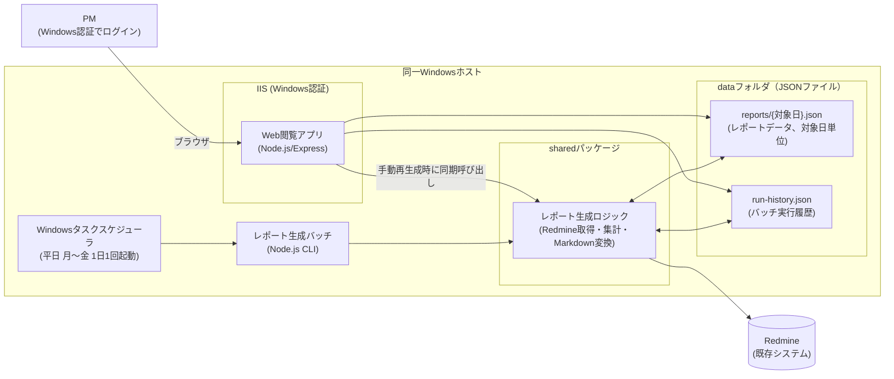

# システム構成図

## 構成図


## コンポーネント一覧
| コンポーネント | 役割 | 技術（提案） |
|---|---|---|
| Web閲覧アプリ | レポート一覧・詳細・実行履歴の表示、Markdownエクスポート、手動再生成の受付。Windows認証でアクセス制御 | Node.js + TypeScript + Express、IIS + iisnodeでホストしIISのWindows認証機能を利用 |
| レポート生成バッチ | タスクスケジューラから起動されるCLI。対象日（直前の営業日）のレポートを1件生成する | Node.js + TypeScript（CLIスクリプト） |
| レポート生成ロジック（shared） | Redmineからの取得・集計・Markdown変換など、バッチとWeb閲覧アプリ（手動再生成時）の両方から使う共通処理 | Node.js + TypeScript の共有パッケージ |
| データ（JSONファイル） | レポート・実行履歴の永続化。DBは使用しない | `reports/{対象日}.json` / `run-history.json`（詳細は`detailed-design.md`） |
| Redmine | チケット・作業時間・更新履歴の取得元（既存システム） | REST API（APIキー認証） |
| Windowsタスクスケジューラ | レポート生成バッチを平日1日1回起動するトリガー | OS標準機能 |

## プロセスと実行ユーザー
| プロセス | 実行主体 | 必要な権限・前提 |
|---|---|---|
| Web閲覧アプリ | IISのアプリケーションプールID | `data/`配下の読み書き権限、`config/config.json`の読み取り権限、Redmine APIへの到達性（手動再生成時） |
| レポート生成バッチ | タスクスケジューラで指定した実行ユーザー | `data/`配下の読み書き権限、`config/config.json`の読み取り権限、Redmine APIへの到達性 |

Web閲覧アプリ（手動再生成時）とレポート生成バッチは別プロセス・別ユーザーで同じJSONファイルを
更新しうるため、ファイルロック（`proper-lockfile`等）で排他制御する（詳細は`detailed-design.md`4章）。
`config/config.json`にはRedmine APIキーが含まれるため、上記2つの実行主体のみが読める権限に絞る。

## ディレクトリ構成（提案）
```
repo-root/
├── docs/
│   ├── requirements/requirements.md
│   └── design/
│       ├── detailed-design.md   # 全体像・データ設計・連携仕様・非機能設計
│       ├── architecture.md      # 本ファイル：システム構成図
│       ├── sequence.md          # シーケンス図
│       ├── screen-spec.md       # 画面仕様
│       ├── screen-mockup.html   # 画面モック（ブラウザで開いて確認）
│       └── api-design.md        # API設計書
├── webapp/            # Web閲覧アプリ（画面+API）
│   └── src/
├── batch/              # レポート生成バッチ（タスクスケジューラから起動）
│   └── src/
├── shared/             # Redmine連携・集計ロジック・JSON読み書き・型定義など共有コード
│   └── src/
├── config/
│   └── config.example.json   # Redmine接続情報・対象プロジェクト等の雛形（実値は.gitignore対象）
└── data/
    ├── reports/
    │   └── {対象日 YYYY-MM-DD}.json
    └── run-history.json
```
