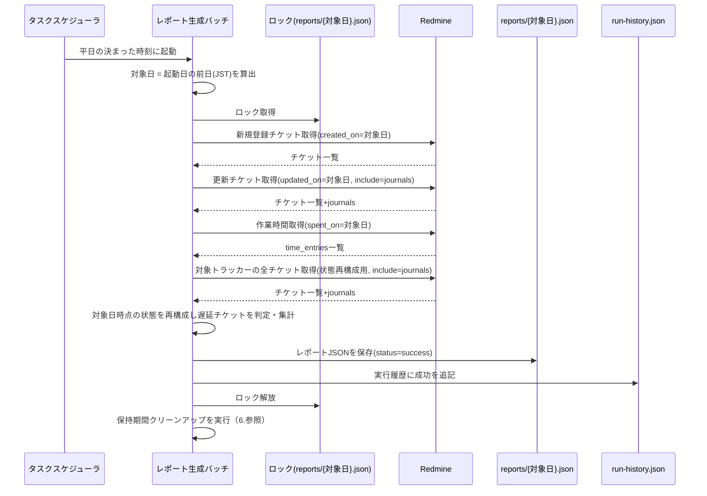
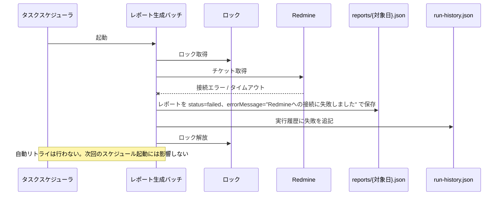
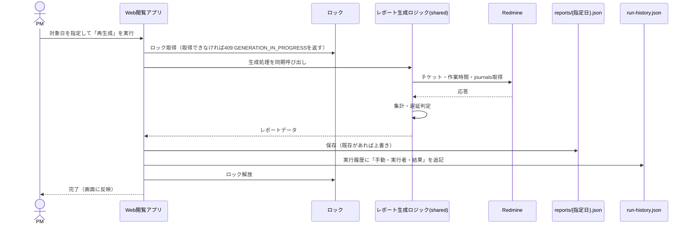
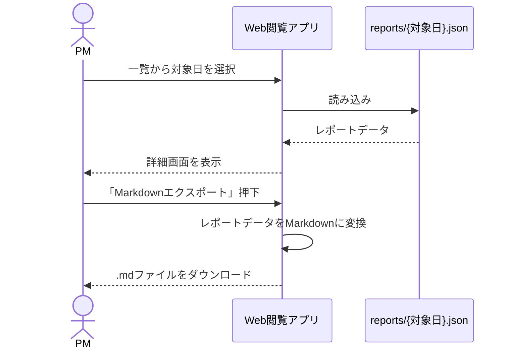
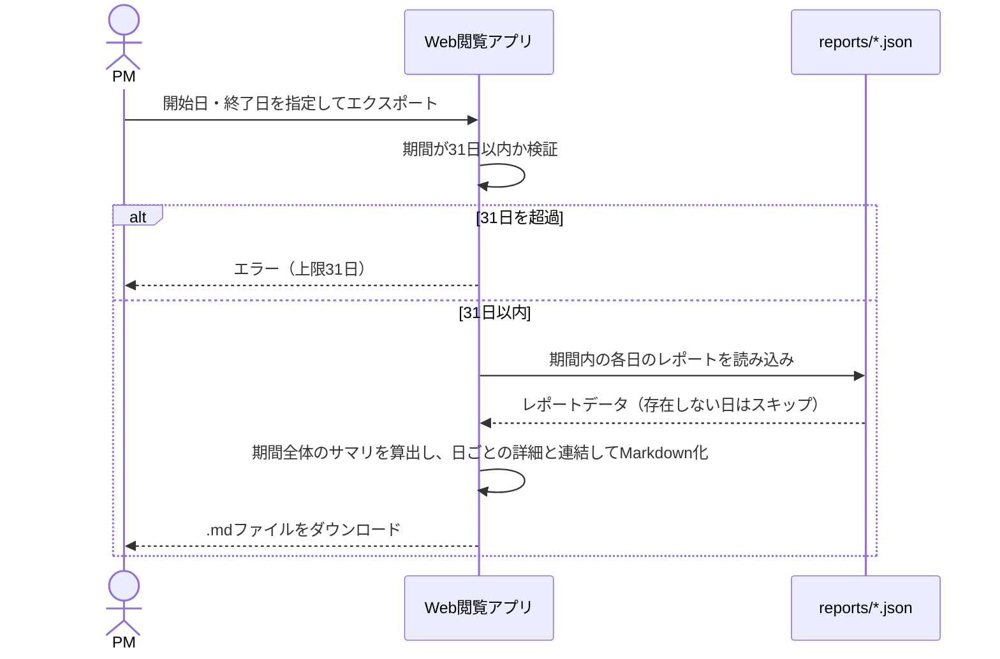
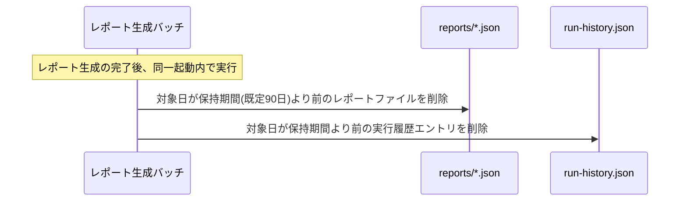
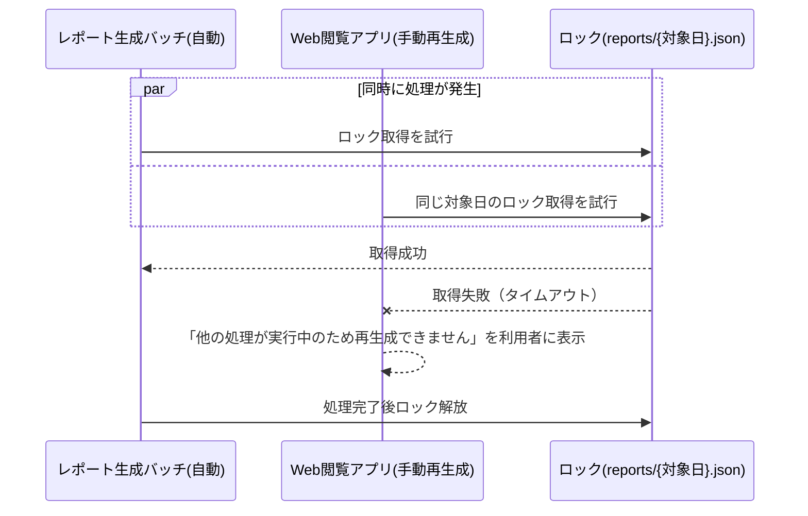

# シーケンス図

## 1. 自動レポート生成（正常系）

```mermaid
sequenceDiagram
    participant S as タスクスケジューラ
    participant B as レポート生成バッチ
    participant L as ロック(reports/{対象日}.json)
    participant R as Redmine
    participant F as reports/{対象日}.json
    participant H as run-history.json

    S->>B: 平日の決まった時刻に起動
    B->>B: 対象日 = 起動日の前日(JST)を算出
    B->>L: ロック取得
    B->>R: 新規登録チケット取得(created_on=対象日)
    R-->>B: チケット一覧
    B->>R: 更新チケット取得(updated_on=対象日, include=journals)
    R-->>B: チケット一覧+journals
    B->>R: 作業時間取得(spent_on=対象日)
    R-->>B: time_entries一覧
    B->>R: 対象トラッカーの全チケット取得(状態再構成用, include=journals)
    R-->>B: チケット一覧+journals
    B->>B: 対象日時点の状態を再構成し遅延チケットを判定・集計
    B->>F: レポートJSONを保存(status=success)
    B->>H: 実行履歴に成功を追記
    B->>L: ロック解放
    B->>B: 保持期間クリーンアップを実行（6.参照）
```

## 2. 自動レポート生成（Redmine接続失敗）

```mermaid
sequenceDiagram
    participant S as タスクスケジューラ
    participant B as レポート生成バッチ
    participant L as ロック
    participant R as Redmine
    participant F as reports/{対象日}.json
    participant H as run-history.json

    S->>B: 起動
    B->>L: ロック取得
    B->>R: チケット取得
    R--xB: 接続エラー / タイムアウト
    B->>F: レポートを status=failed、errorMessage="Redmineへの接続に失敗しました" で保存
    B->>H: 実行履歴に失敗を追記
    B->>L: ロック解放
    Note over S,B: 自動リトライは行わない。次回のスケジュール起動には影響しない
```

## 3. Web画面からの手動再生成

```mermaid
sequenceDiagram
    actor U as PM
    participant W as Web閲覧アプリ
    participant L as ロック
    participant G as レポート生成ロジック(shared)
    participant R as Redmine
    participant F as reports/{指定日}.json
    participant H as run-history.json

    U->>W: 対象日を指定して「再生成」を実行
    W->>L: ロック取得（取得できなければ409 GENERATION_IN_PROGRESSを返す）
    W->>G: 生成処理を同期呼び出し
    G->>R: チケット・作業時間・journals取得
    R-->>G: 応答
    G->>G: 集計・遅延判定
    G-->>W: レポートデータ
    W->>F: 保存（既存があれば上書き）
    W->>H: 実行履歴に「手動・実行者・結果」を追記
    W->>L: ロック解放
    W-->>U: 完了（画面に反映）
```

## 4. レポート閲覧・単日Markdownエクスポート

```mermaid
sequenceDiagram
    actor U as PM
    participant W as Web閲覧アプリ
    participant F as reports/{対象日}.json

    U->>W: 一覧から対象日を選択
    W->>F: 読み込み
    F-->>W: レポートデータ
    W-->>U: 詳細画面を表示
    U->>W: 「Markdownエクスポート」押下
    W->>W: レポートデータをMarkdownに変換
    W-->>U: .mdファイルをダウンロード
```

## 5. 期間指定Markdownエクスポート

```mermaid
sequenceDiagram
    actor U as PM
    participant W as Web閲覧アプリ
    participant F as reports/*.json

    U->>W: 開始日・終了日を指定してエクスポート
    W->>W: 期間が31日以内か検証
    alt 31日を超過
        W-->>U: エラー（上限31日）
    else 31日以内
        W->>F: 期間内の各日のレポートを読み込み
        F-->>W: レポートデータ（存在しない日はスキップ）
        W->>W: 期間全体のサマリを算出し、日ごとの詳細と連結してMarkdown化
        W-->>U: .mdファイルをダウンロード
    end
```

## 6. 保持期間クリーンアップ

```mermaid
sequenceDiagram
    participant B as レポート生成バッチ
    participant F as reports/*.json
    participant H as run-history.json

    Note over B: レポート生成の完了後、同一起動内で実行
    B->>F: 対象日が保持期間(既定90日)より前のレポートファイルを削除
    B->>H: 対象日が保持期間より前の実行履歴エントリを削除
```

## 7. 多重起動防止（自動バッチと手動再生成の競合）

```mermaid
sequenceDiagram
    participant B as レポート生成バッチ(自動)
    participant W as Web閲覧アプリ(手動再生成)
    participant L as ロック(reports/{対象日}.json)

    par 同時に処理が発生
        B->>L: ロック取得を試行
    and
        W->>L: 同じ対象日のロック取得を試行
    end
    L-->>B: 取得成功
    L--xW: 取得失敗（タイムアウト）
    W-->>W: 「他の処理が実行中のため再生成できません」を利用者に表示
    B->>L: 処理完了後ロック解放
```
